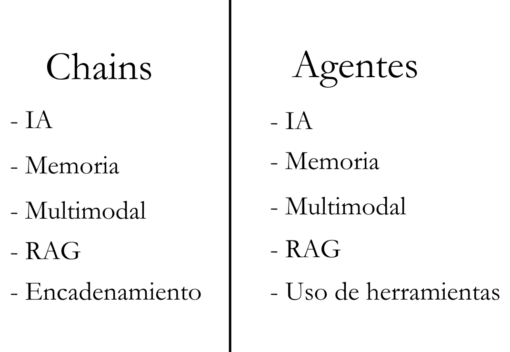

# Parte 5: Introducción a Agentes

En esta quinta parte del curso, nos adentraremos en los agentes. Los agentes son sistemas que utilizan modelos de lenguaje para razonar y tomar acciones.

## Contenidos

- [¿Qué son los Agentes?](#qué-son-los-agentes)
- [Herramientas](#herramientas)
- [Chains vs Agentes](#chains-vs-agentes)

## ¿Qué son los Agentes?

Los modelos de lenguaje por sí solos no pueden realizar acciones - solo generan texto. Aquí es donde entran los agentes.

Un agente es un sistema que utiliza un modelo de lenguaje (LLM) como motor de razonamiento para:
- Determinar qué acciones tomar
- Decidir qué inputs usar para esas acciones
- Evaluar los resultados de las acciones
- Determinar si se necesitan más acciones o si la tarea está completa

Es como tener un asistente que no solo piensa, sino que también puede interactuar con el mundo a través de herramientas.

## Herramientas

Las herramientas son funciones que los agentes pueden usar para interactuar con el mundo. 

Guía de herramientas: 
[Herramientas](../../integraciones/langchain/tools)

## Chains vs Agentes

En todos nuestros proyectos debemos tener mínimo una chain o un agente, pero, ¿cuándo usar cada uno?

### Chains

- Cuando se trate de un proyecto que no requiera de toma de acciones.

### Agentes

- Cuando se requiera de toma de acciones para completar un proyecto exitoso. 

## Links Relevantes

- [Agentes](../../integraciones/langchain/agents)
- [Herramientas](../../integraciones/langchain/tools)
