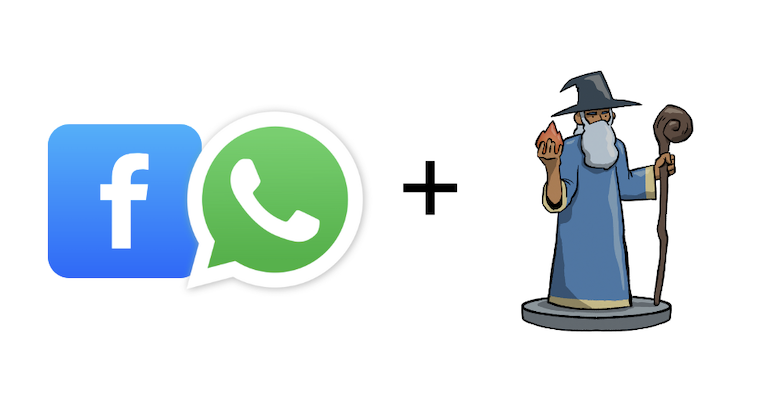

# Desafío 5: Agente Game Master para Aventuras de Texto 

Diseñar y construir un chatbot que actúe como un Game Master (Director de Juego) para una aventura interactiva de texto, y que pueda ser desplegado en una plataforma de mensajería como WhatsApp, Telegram o Facebook Messenger.

## Reto

Crear un agente que pueda:
- Presentar al usuario el inicio de una aventura de texto con una premisa y un personaje.
- Proponer al menos dos opciones o decisiones al usuario que influyan en el desarrollo de la historia.
- Adaptar la narrativa y generar la siguiente parte de la historia basándose en la elección del usuario.

## Requisitos

- Integración con una plataforma de mensajería (WhatsApp, Facebook Messenger).
- Deben de haber razones por las que se pueda acabar la historia

