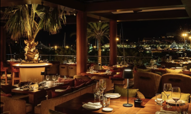

# Desafío 7: Asistente de Reservas para Restaurante Gourmet

## Objetivo

Crear un Sequential Agent en Flowise que asista a los usuarios en el proceso de reservar una mesa en un restaurante gourmet. El agente debe guiar al usuario a través de una serie de pasos, utilizando un flujo de preguntas y respuestas, e integrando herramientas para completar la reserva.

## Requisitos

Debe de saludar al usuario y presentarse.
Debe obtener la fecha y hora deseadas para la reserva.
Debe obtener el número de comensales.
Si el número de comensales supera un límite (por ejemplo, 6 personas), informar al usuario de que no tienen mesas para más de 5 personas.
Obtener el nombre, teléfono y correo del cliente.
Enviar toda la información recogida a un Google Sheets.
Preguntar si el cliente tiene alguna alergias.
Si el cliente indica que tiene alergias, usar la retriever tool para informarle de qué platos no podrá tomar del menú.
Confirmar la reserva.
Enviar un resumen de la reserva al usuario por correo con todos los detalles, incluido si aplica qué platos no debe de tomar por alergia.

## Escenario
Un usuario interactúa con el Sequential Agent, el usuario desea reservar para el sábado 1 de mayo de 2024 (Día del Trabajo) a las 21:00 horas para 4 personas. El usuario se llama "Ana López", su teléfono es "+34 612345678", y su correo electrónico es "ana.lopez@dominio.com". Ana menciona que es alérgica a los frutos secos.

## Recursos

[Menú del restaurante](../../../pdf/menu.degustacion.pdf))