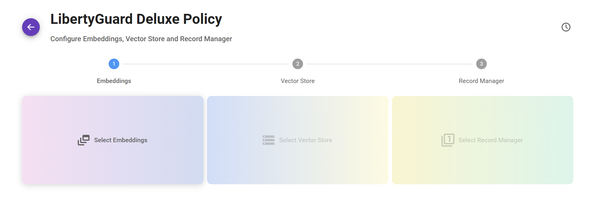
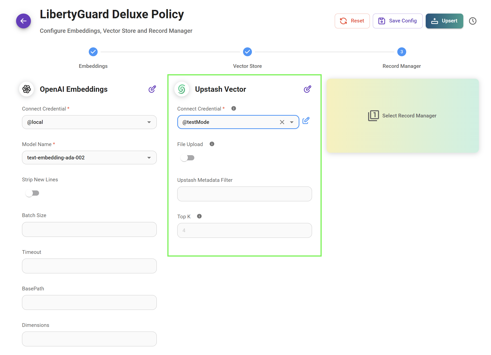
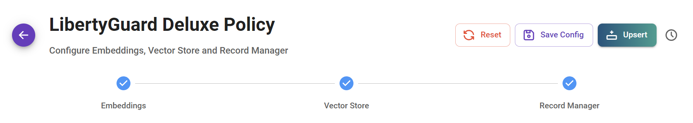

# Document Stores

***

Flowise's Document Stores offer a versatile approach to data management, enabling you to upload, split, and prepare your data for upserting your datasets in a single location.

This centralized approach simplifies data handling and allows for efficient management of various data formats, making it easier to organize and access your data within the Flowise app.

## Setup

In this tutorial, we will set up a [Retrieval Augmented Generation (RAG)](../use-cases/multiple-documents-qna.md) system to retrieve information about the _LibertyGuard Deluxe Homeowners Policy_, a topic that LLMs are likely not extensively trained on.

Using the **Flowise Document Stores**, we'll prepare and upsert data about LibertyGuard and its set of home insurance policies. This will enable our RAG system to accurately answer user queries about LibertyGuard's home insurance offerings.

## 1. Add a Document Store

* Start by adding a Document Store and naming it. In our case, "LibertyGuard Deluxe Homeowners Policy".

<figure><figcaption></figcaption></figure>

## 2. Select a Document Loader

* Enter the Document Store we just created and select the [Document Loader](../integrations/langchain/document-loaders/) you want to use. In our case, since our dataset is in PDF format, we'll use the [PDF Loader](../integrations/langchain/document-loaders/pdf-file.md).

<figure><figcaption></figcaption></figure>

<figure><figcaption></figcaption></figure>

## 3. Prepare your data

* First, we start by uploading our PDF file.
* Then, we add a **unique metadata key**. This is optional, but a good practice as it allows us to target and filter down this same dataset later on if we need to.

<figure><figcaption></figcaption></figure>

* Finally, select the [Text Splitter](../integrations/langchain/text-splitters/) you want to use to chunk your data. In our particular case, we will use the [Recursive Character Text Splitter](../integrations/langchain/text-splitters/recursive-character-text-splitter.md).


In this guide, we've added a generous **Chunk Overlap** size to ensure no relevant data gets missed between chunks. However, the optimal overlap size is dependent on the complexity of your data. You may need to adjust this value based on your specific dataset and the nature of the information you want to extract.


<figure><figcaption></figcaption></figure>

## 4. Preview your data

* We can now preview how our data will be chunked using our current [Text Splitter](../integrations/langchain/text-splitters/) configuration; `chunk_size=1500`and `chunk_overlap=750`.

<figure><figcaption></figcaption></figure>

* It's important to experiment with different [Text Splitters](../integrations/langchain/text-splitters/), Chunk Sizes, and Overlap values to find the optimal configuration for your specific dataset. This preview allows you to refine the chunking process and ensure that the resulting chunks are suitable for your RAG system.

<figure><figcaption></figcaption></figure>


Note that our custom metadata `company: "liberty"` has been inserted into each chunk. This metadata allows us to easily filter and retrieve information from this specific dataset later on, even if we use the same vector store index for other datasets.


## 5. Process your data

* Once you are satisfied with the chunking process, it's time to process your data.

<figure><figcaption></figcaption></figure>

<figure><figcaption></figcaption></figure>

Note that once you have processed your data, you will be able to **edit your chunks** by deleting or adding data to them. This is beneficial if:

* **You discover inaccuracies or inconsistencies in the original data:** Editing chunks allows you to correct errors and ensure the information is accurate.
* **You want to refine the content for better relevance:** You can adjust chunks to emphasize specific information or remove irrelevant sections.
* **You need to tailor chunks for specific queries:** You can make them more targeted to the types of questions you expect to receive.

## 6. Configure the upsert process

* With our data processed, loaded via a document loader, and appropriately chunked, we can now proceed to configure the upsert process.

<figure><figcaption></figcaption></figure>

The upsert process comprises four fundamental steps:

1. **Embedding Model Selection:** We begin by choosing the appropriate embedding model to encode our dataset. This model will transform our data into a numerical vector representation.
2. **Data Store Selection:** Next, we determine the Vector Store where our dataset will reside.
3. **Record Manager Selection (Optional):** Finally, we have the option to implement a Record Manager. This component provides the functionalities for managing our dataset once it's stored within the Vector Store.

<figure><figcaption></figcaption></figure>

### 1. Select Embeddings

* Click on the "Select Embeddings" card and choose your preferred embedding model. In our case, we will select OpenAI as the embedding provider and use the "text-embedding-ada-002" model with 1536 dimensions.

<figure><figcaption></figcaption></figure>

### 2. Select Vector Store

* Click on the "Select Vector Store" card and choose your preferred Vector Store. In our case, as we need a production-ready one, we will select Upstash.

<figure><figcaption></figcaption></figure>

### 3. Select Record Manager

* For advanced dataset management within the Vector Store, you can optionally select and configure a Record Manager. Detailed instructions on how to set up and utilize this feature can be found in the dedicated [guide](../integrations/langchain/record-managers.md).

<figure><figcaption></figcaption></figure>

## 7. Upsert your data to a Vector Store

* To begin the upsert process and transfer your data to the Vector Store, click the "Upsert" button.

<figure><figcaption></figcaption></figure>

* The capture below demonstrates the successful upsertion of our data into Upstash, divided into 85 chunks for efficient processing.

<figure><figcaption></figcaption></figure>

## 8. Test your dataset

* To quickly test the functionality of your dataset without navigating away from the Document Store, simply utilize the "Retrieval Query" button. This initiates a test query, allowing you to verify the accuracy and effectiveness of your data retrieval process.

<figure><figcaption></figcaption></figure>

* In our case, we see that when querying for information about kitchen flooring coverage in our insurance policy, we retrieve 4 relevant chunks from Upstash, our designated Vector Store. This retrieval is limited to 4 chunks as per the defined "top k" parameter, ensuring we receive the most pertinent information without unnecessary redundancy.

<figure><figcaption></figcaption></figure>

## 9. Test your RAG

* Finally, our Retrieval-Augmented Generation (RAG) system is operational. It's noteworthy how the LLM effectively interprets the query and successfully leverages relevant information from the chunked data to construct a comprehensive response.

<figure><figcaption></figcaption></figure>

## 10. Summary

We started by creating a Document Store to organize the LibertyGuard Deluxe Homeowners Policy data. This data was then prepared by uploading, chunking, processing, and upserting it, making it ready for our RAG system.

### Key benefits of using the Document Stores

* **Organization and Management:** The Document Store provides a centralized location for storing, managing, and preparing our data.
* **Data Quality:** The chunking process helps ensure that our data is structured in a way that facilitates accurate retrieval and analysis.
* **Flexibility:** The Document Store allows us to refine and adjust our data as needed, improving the accuracy and relevance of our RAG system.
