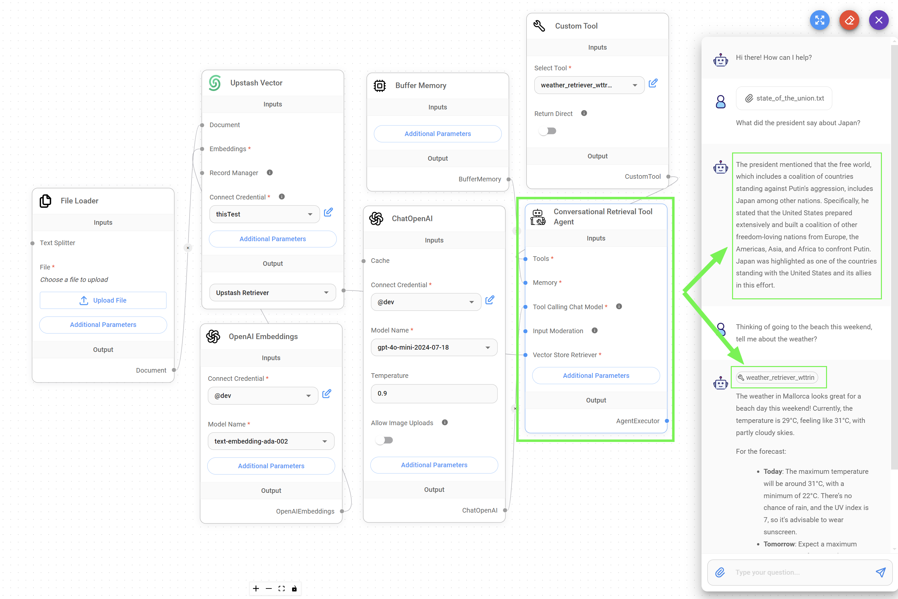

# Uploads

Flowise allow users to upload documents (images, audios & files) from the chat. In this section, we will go through each and see how to enable the feature and using it.

## Uploading Images

Certain Chat Models allow user to input images:

* [ChatOpenAI](../integrations/llamaindex/chat-models/chatopenai.md)
* [AzureChatOpenAI](../integrations/llamaindex/chat-models/azurechatopenai.md)
* [ChatAnthropic](../integrations/langchain/chat-models/chatanthropic.md)
* [AWSChatBedrock](../integrations/langchain/chat-models/aws-chatbedrock.md)
* [ChatGoogleGenerativeAI](../integrations/langchain/chat-models/google-ai.md)

When **Allow Image Upload** is enabled, images can be uploaded from chat interface.

<div align="center">

<figure><figcaption></figcaption></figure>

 

<figure><figcaption></figcaption></figure>

</div>

To perform the same using API:



```python
import requests
API_URL = "http://localhost:3000/api/v1/prediction/&#x3C;chatlfowid>"

def query(payload):
    response = requests.post(API_URL, json=payload)
    return response.json()
    
output = query({
    "question": "Can you describe the image?",
    "uploads": [
        {
            "data": 'data:image/png;base64,iVBORw0KGgdM2uN0', # base64 string or url
            "type": 'file', # file | url
            "name": 'Flowise.png',
            "mime": 'image/png'
        }
    ]
})
```



```javascript
async function query(data) {
    const response = await fetch(
        "http://localhost:3000/api/v1/prediction/<chatlfowid>",
        {
            method: "POST",
            headers: {
                "Content-Type": "application/json"
            },
            body: JSON.stringify(data)
        }
    );
    const result = await response.json();
    return result;
}

query({
    "question": "Can you describe the image?",
    "uploads": [
        {
            "data": 'data:image/png;base64,iVBORw0KGgdM2uN0', //base64 string or url
            "type": 'file', //file | url
            "name": 'Flowise.png',
            "mime": 'image/png'
        }
    ]
}).then((response) => {
    console.log(response);
});
```



## Uploading Audio

Under Chatflow Configuration, user can select a **Speech to Text** module. Supported integrations are:

* OpenAI
* AssemblyAI
* [LocalAI](../integrations/langchain/chat-models/chatlocalai.md)

When enabled, users can speak directly into microphone and speech will be transcribed into text.

<div align="left">

<figure><figcaption></figcaption></figure>

 

<figure><figcaption></figcaption></figure>

</div>

To perform the same using API:



```python
import requests
API_URL = "http://localhost:3000/api/v1/prediction/&#x3C;chatlfowid>"

def query(payload):
    response = requests.post(API_URL, json=payload)
    return response.json()
    
output = query({
    "uploads": [
        {
            "data": 'data:audio/webm;codecs=opus;base64,GkXf', #base64 string
            "type": 'audio',
            "name": 'audio.wav',
            "mime": 'audio/webm'
        }
    ]
})
```



```javascript
async function query(data) {
    const response = await fetch(
        "http://localhost:3000/api/v1/prediction/<chatlfowid>",
        {
            method: "POST",
            headers: {
                "Content-Type": "application/json"
            },
            body: JSON.stringify(data)
        }
    );
    const result = await response.json();
    return result;
}

query({
    "uploads": [
        {
            "data": 'data:audio/webm;codecs=opus;base64,GkXf', //base64 string
            "type": 'audio',
            "name": 'audio.wav',
            "mime": 'audio/webm'
        }
    ]
}).then((response) => {
    console.log(response);
});
```



## Uploading Files

Users can upload files from the chat as well. Uploaded files will be upserted on the fly to the Vector Store. However, to enable file uploads feature, there are a few pre-requisites.

1. A file-upload supported Vector Store must be present in the chatflow.

* [Pinecone](../integrations/langchain/vector-stores/pinecone.md)
* [Milvus](../integrations/langchain/vector-stores/milvus.md)
* [Postgres](../integrations/langchain/vector-stores/postgres.md)
* [Qdrant](../integrations/langchain/vector-stores/qdrant.md)
* [Upstash](../integrations/langchain/vector-stores/upstash-vector.md)

2. If you have multiple Vector Stores on a chatflow, you can only turn on file upload for one vector store at a time.
3. At least one Document Loader node should be connected to the vector store's Document input. Supported Document Loader:

* [CSV File](../integrations/langchain/document-loaders/csv-file.md)
* [Docx File](../integrations/langchain/document-loaders/docx-file.md)
* [Json File](../integrations/langchain/document-loaders/json-file.md)
* [Json Lines File](../integrations/langchain/document-loaders/json-lines-file.md)
* [PDF File](../integrations/langchain/document-loaders/pdf-file.md)
* [Text File](../integrations/langchain/document-loaders/text-file.md)
* [Unstructured File](../integrations/langchain/document-loaders/unstructured-file-loader.md)

<figure><figcaption></figcaption></figure>

4. One or multiple files can be uploaded on the chat:

<div align="left">

<figure><figcaption></figcaption></figure>

 

<figure><figcaption></figcaption></figure>

</div>

### Here's how it works:

* Uploaded files will have the metadata updated with the chatId.
* This will allow the file to be associated with the chatId.
* When querying, an **OR** filter is being applied:
  * Metadata contains `flowise_chatId` and the value equals to the current chat session id
  * Metadata does not contains `flowise_chatId`

An example of a vector embeddings upserted on Pinecone:

<figure><figcaption></figcaption></figure>

### Uploading Files & Tool Agent

**Problem**

When using a [Tool Agent](../integrations/langchain/agents/tool-agent.md) and needing to connect it to a Vector Store, we must utilize a [Retriever Tool](../integrations/langchain/tools/retriever-tool.md) within our chatflow. This Retriever Tool requires pre-configured name and description fields to provide the LLM with sufficient context for proper utilization.

However, since **we cannot hardcode a precise retriever description about the document's content before it's uploaded in the front end**, we must use more general prompts, which may not always be effective. This limitation can lead to inefficiencies, as the LLM may not always recognize when to call the Retriever Tool for answering questions related to the uploaded document.\
\
In essence, the problem lies in the inability to dynamically update the Retriever Tool's description to accurately reflect the content of the uploaded document, hindering the LLM's ability to determine when to call the Retriever Tool.

#### Solution

This problem can be solved by using the `Conversational Retrieval Tool Agent`, a community node that merges the ability of using Vector Stores without relying on the Retriever Tool with the ability of calling tools as if it were an Agent tool.

<figure><figcaption></figcaption></figure>



**Community Nodes:** In order to start using community nodes in your Flowise instance, you need to set the following environment variable `SHOW_COMMUNITY_NODES=TRUE`

