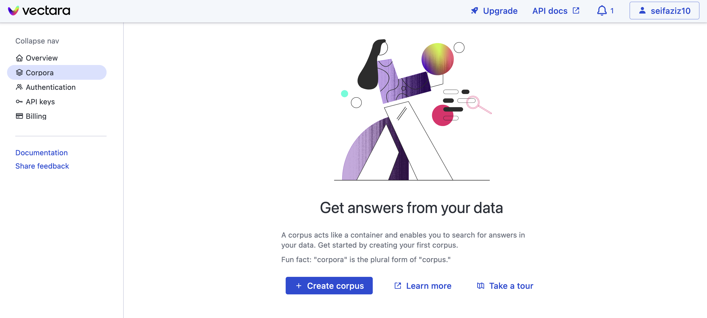
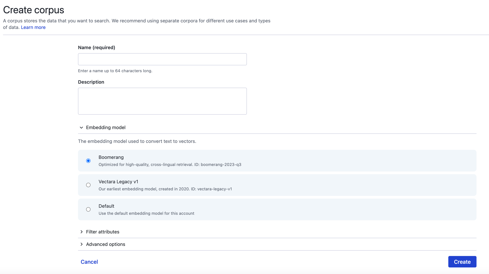
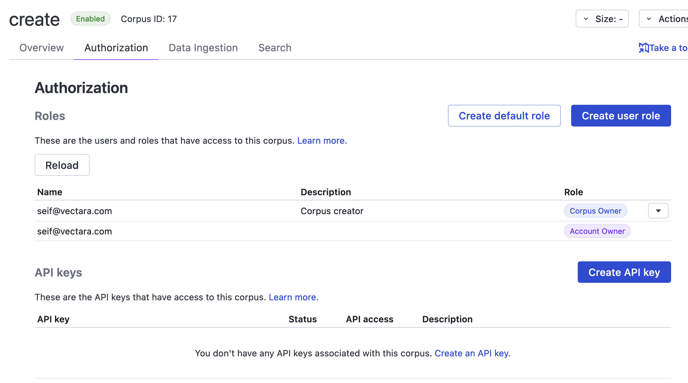
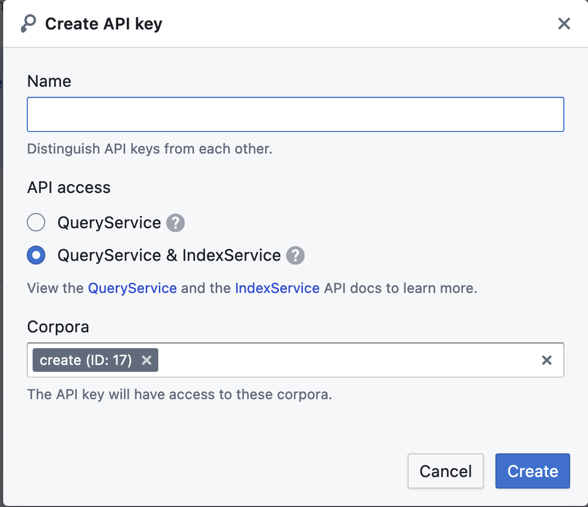
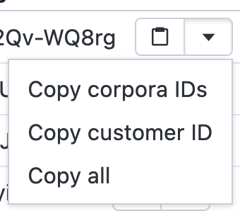
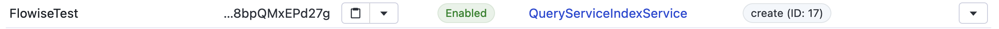
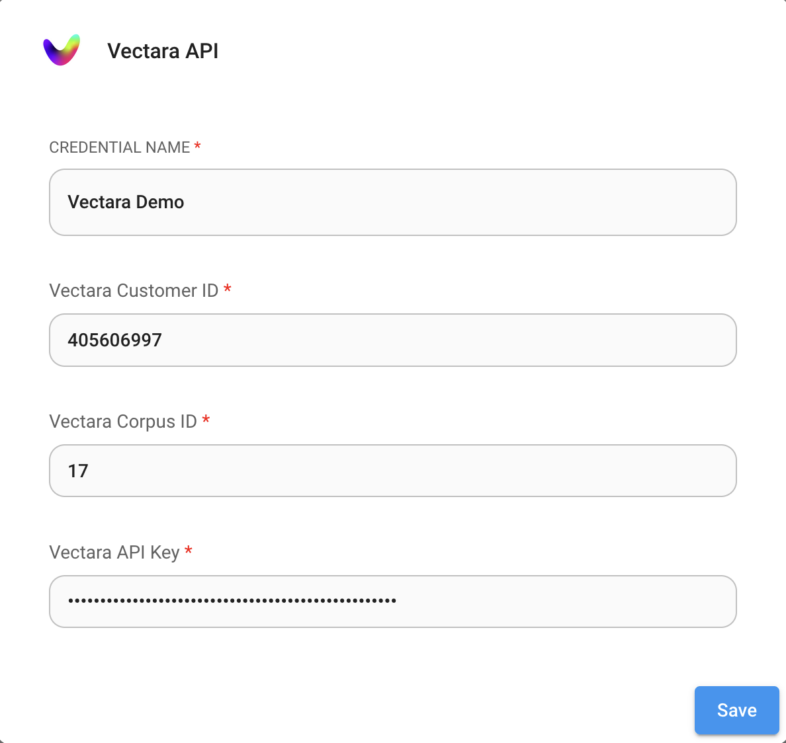
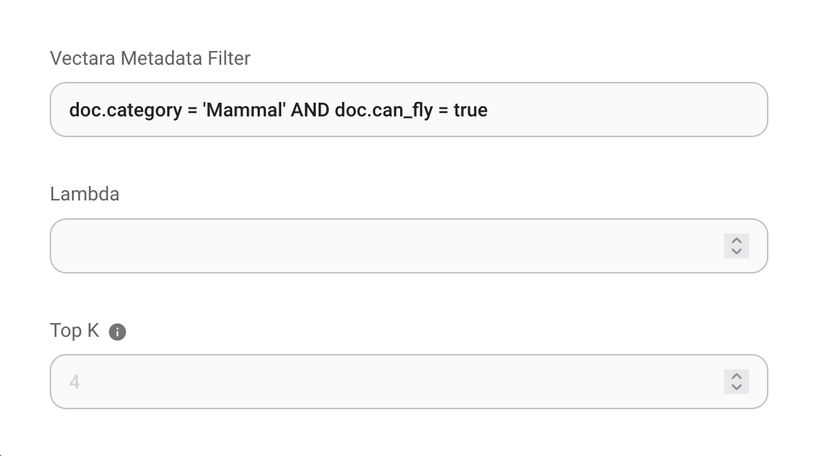

# Vectara

## Prerequisite

1. Register an account for [Vectara](https://console.vectara.com/signup)
2. Click **Create Corpus**

<figure><figcaption></figcaption></figure>

3. Input required fields:

- **Name**: name of the corpus to be created

<figure><figcaption></figcaption></figure>

4. Click **Create** and wait for the corpus to finish setting up

## Setup

1. Click on the **"Authorization"** tab in the corpus view

<figure><figcaption></figcaption></figure>

2. Click on the **"Create API Key"** button, choose a name for the API key and pick the **QueryService & IndexService** option

<figure><figcaption></figcaption></figure>

3. Click **Create** to create the API key
4. Get your **Corpus ID, API Key, and Customer ID**

<figure><figcaption></figcaption></figure>

5. Back to Flowise canvas, drag and drop Vectara nodes. Click **Create New** from the Credentials dropdown:

<figure><figcaption></figcaption></figure>

6. Copy & Paste each details (Corpus ID, Customer ID, API Key) into below:

<figure><figcaption></figcaption></figure>

7. Now you can connect any Document node under [**Document Loader**](../document-loaders.md) category to Vectara [🎉](https://emojipedia.org/party-popper/)

## Filters

### Prerequesites:

1. Ensure that a Vectara corpus with filters is already created.
2. Upload documents with metadata to that corpus.
3. Ensure that a Vectara component is created in Flowise.

### Setup

To add filters, click on "Additional Parameters," and then input your filter string in the metadata filter field.

For more details on how to use Vectara filters, please refer to the <a href="https://docs.vectara.com/docs/common-use-cases/filtering-by-metadata/filter-overview">official documentation</a>.

<figure><figcaption></figcaption></figure>

## Resources

- [LangChain JS Vectara Blog](https://blog.langchain.dev/langchain-vectara-better-together/)
- [5 Reasons to Use Vectara's Langchain Integration Blog Post](https://vectara.com/5-reasons-to-use-vectaras-langchain-integration/)
